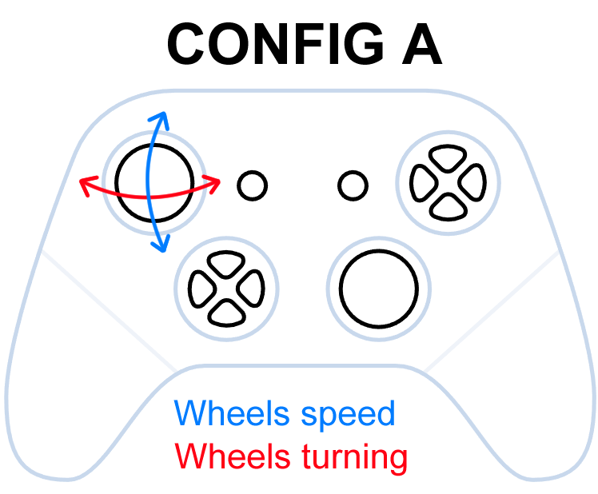
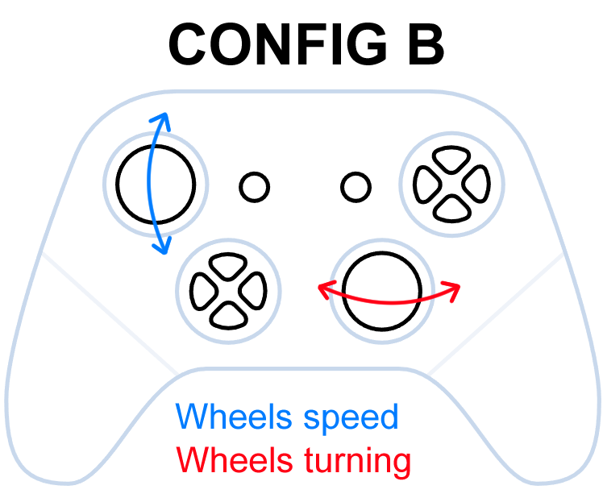
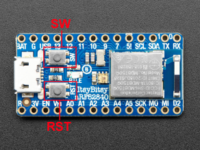

# Wheelchair Ergometer Game Controller

This project interfaces an Invictus Trainer with a computer or a phone by using encoders and an nRF52840. The video shows a gameplay demo, where you can see what the player sees on the screen to the left of the player.


## Installing the SDK
The project uses the [Zephyr RTOS](https://docs.zephyrproject.org/latest/) and the [nRF Connect SDK](https://developer.nordicsemi.com/nRF_Connect_SDK/doc/2.1.2/nrf/index.html). To get started, you must download the nRF Connect SDK which comes with the Zephyr RTOS included: [See the installation guide for a how-to](https://developer.nordicsemi.com/nRF_Connect_SDK/doc/2.1.2/nrf/gs_assistant.html)

## Project Setup
### Using an existing nRF Connect SDK installation (recommended)
- Clone this project into the root-level folder of a working [nRF Connect SDK v2.1.2 installation](https://developer.nordicsemi.com/nRF_Connect_SDK/doc/2.1.2/nrf/gs_assistant.html)

Note: In Zephyr terminology, this is a [Zephyr workspace application](https://docs.zephyrproject.org/latest/develop/application/index.html#zephyr-repository-application)

## Building
To build a project, follow [the official nRF Connect SDK guide](https://developer.nordicsemi.com/nRF_Connect_SDK/doc/2.1.2/nrf/gs_programming.html)

In short, navigate to the `wheelchair-ergometer-game-contrller` folder (this may be referred to as the root folder in later parts) and call `west build -b nrf52840dk_nrf52840` for building for the nRF52840 DK. Call `west build -b adafruit_itsybitsy_nrf52840` to build for the Adafruit ItsyBitsy nRF52840 Express.

> **NOTE:** Sometimes the building might fail for various reasons. If you get error messages that don't make sense to you, try to do a clean rebuild by either deleting the `wheelchair-ergometer-game-controller/project-code/build` folder and/or calling `west build -p -b adafruit_itsybitsy_nrf52840`.

### Required first time setup for the Adafruit ItsyBitsy nRF52840
Zephyr does not currently support building for the Adafruit ItsyBitsy nRF52840. You must add this support by copying the `adafruit_itsybitsy_nrf52840` folder into `ncs/v2.1.2/zephyr/boards/arm`. The result should be that `adafruit_itsybitsy_nrf52840.dts` should be found here: `ncs/v2.1.2/zephyr/boards/arm/adafruit_itsybitsy_nrf52840/adafruit_itsybitsy_nrf52840.dts`.


> **If you have not done the copying described above properly, you will get a "board not recognized" warning when you try to build using the `adafruit_itsybitsy_nrf52840` target.**

## Flashing
### nRF52840 DK
Call `west build -b nrf52840dk_nrf52840` followed by `west flash` when the device is plugged into the PC.

### Adafruit ItsyBitsy nRF52840 Express
#### First time setup
The ItsyBitsy comes with the Adafruit UF2 bootloader. This bootloader must be updated as described [in the Adafruit nRF52840 guide](https://learn.adafruit.com/introducing-the-adafruit-nrf52840-feather/update-bootloader) (note that this guide is for the nRF52840 Feather, but the same applies ItsyBitsy nRF52840). I have only gotten it to work following the [command line instructions part of the tutorial](https://learn.adafruit.com/introducing-the-adafruit-nrf52840-feather/update-bootloader-use-command-line).

> If the ItsyBitsy ever starts pulsating red, it means something is wrong and you might have to reflash the bootloader firmware as described above. To save you some time, here is the command I usually use: `adafruit-nrfutil.exe --verbose dfu serial --package itsybitsy_nrf52840_express_bootloader-0.7.0_s140_6.1.1.zip --port COM9 -b 115200 --singlebank --touch 1200`

#### Flashing
Flashing a program is done by dragging and dropping a `.uf2`-file into the "drive" when it is in boot mode (double tap the RST button). To generate a `.uf2` file, make sure to enable `CONFIG_BUILD_OUTPUT_UF2=y` in the project configuration (`prj.conf`-file).

To build and flash, perform the following steps:
1. In the root folder, call ```west build -b adafruit_itsybitsy_nrf52840```
2. Navigate to `build/zephyr` from the root folder
3. Double tap the `RST` button on the ItsyBitsy to enable bootloader mode
4. From `build/zephyr`, drag `zephyr.uf2` into the removable drive `ITSY840BOOT`.
5. The light on the ItsyBitsy should flicker for a bit before the device disconnects. This means the flash is successful.

> If the ItsyBitsy ever starts pulsating red, it means something is wrong and you might have to reflash the bootloader firmware as described in "First Time Setup".

<!-- To flash a program, you must first build it with ```west build -b adafruit_itsybitsy_nrf52840```. Then, you must convert the `.hex`-file at `build/zephyr/zephyr.hex` to a `.zip`-file using `adafruit-nrfutil`
```
adafruit-nrfutil dfu genpkg --dev-type 0x0052 --application zephyr.hex dfu-package.zip
```

Then, put the ItsyBitsy in bootloader mode (double tap RESET, it will blink red) and replace COMxx with the serial port of the ItsyBitsy.
```
adafruit-nrfutil dfu serial --package dfu-package.zip --port COMxx -b 115200
```


- Navigate to folder containing firmware for the microcontroller you want to work with (```./balancing_robot_firmware/<MCU NAME>```) and use west commands for building and flashing the firmware as described in the [developer guide](https://developer.nordicsemi.com/nRF_Connect_SDK/doc/1.9.0/zephyr/guides/west/build-flash-debug.html#west-build-flash-debug). 
-->
## Controller Configuration types
In this project you must choose either `CONFIG_HID_MODULE_CONTROLLER_OUTPUT_A=y`or `CONFIG_HID_MODULE_CONTROLLER_OUTPUT_B=y`. Which controller you choose is based on what you want the ergometer to output. I have only used Config A but Config B might be useful for some purposes!

 


## Connecting to the device
On startup, the device will perform Bluetooth advertisement. It should be found in the pairing menu like you can most normal Bluetooth devices. It is named `Wheelchair Ergometer` and uses Bluetooth LE (4.0).

### Adafruit ItsyBitsy nRF52840 light explanation
| Color | Number of times | Duration | Meaning |
| ----- | --------------- | -------- | ------- |
| Green | 1 | Long | The device successfully booted |
| Blue | 10 | Long | The device is advertising itself as "Wheelchair Ergometer". It should be found when you scan for it on your device.
| Orange | 2 |  Medium | The device is connected but the connection is not secure. | 
| Green |  2 | Medium | The device is connected and the connection is secure | 
| Red | 5 | Medium | The device failed to connect to its peer |
| Red | 2 | Short | The device was disconnected from its peer |

### If the connection somehow fails
The device stores which peers it has been paired to. Currently, it can paired to 2 different phones/PCs. This means that the device might not advertise itself (it only does if it has a free slot to store the pairing), or that the device might fail to connect to a paired device in some other way.

To clear these pairing slots, do the following:
- Reset the device by tapping the "RST" button
- Before 5 seconds have passed, double tap the "SW" button



The device should then clear all the pairing slots which frees it up to try pairing again.